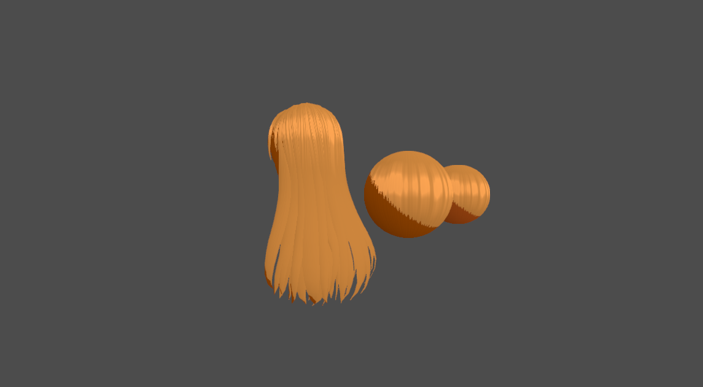

# SimpleToonHair-Godot
Simple toon hair shader project for Godot engine, project need engine version 4.1
Shader supporting diffuse and shadow texture.

Inspired by [GloriaTheAnimator's Ultimate Hair Shader for blender](https://gloriatheanimator.gumroad.com/l/QhzwB)

Using shader noise function from:
https://github.com/stegu/webgl-noise

Hair model from [VRoid Studio](https://vroid.com/en/studio)

## Preview

## How to Use
You can use materials in res://SimpleToonHair/Material as template,
or create ShaderMaterial resource and use shaders in res://SimpleToonHair/Sharder

When you create ShaderMaterial, make sure these three shader params set as below:

